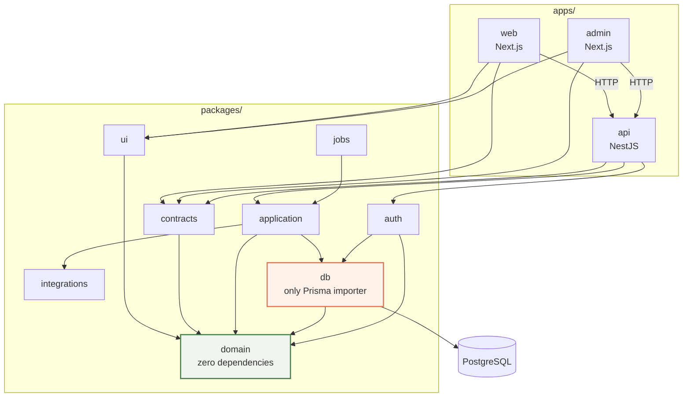

# SaaS Restructure — Implementation Plan

The executable build guide for the decision recorded in
[`ARCHITECTURE-PROPOSAL.md`](./ARCHITECTURE-PROPOSAL.md): **restructure into a monorepo first, then
build multi-tenancy inside it.**

Read with [`STACK-ARCHITECTURE.md`](./STACK-ARCHITECTURE.md) (current layers),
[`DATA-MODEL.md`](./DATA-MODEL.md) (entities) and
[`MIGRATION-GAP-ANALYSIS.md`](./MIGRATION-GAP-ANALYSIS.md) (legacy data).

Phases are ordered by dependency, not by calendar. Each phase states its goal, its tasks, and a
**done-when** that must be true before the next phase starts.

---

## How we build

1. **One package per pull request.** Never two.
2. **Moves are pure moves.** A relocation PR changes zero lines of logic. If a file needs editing,
   that is a separate PR before or after the move — never inside it.
3. **Aliases keep working throughout — and then go.** `@/*` paths resolved to the new locations so
   no move PR broke the rest of the tree; Phase 2.10 retired them (2,687 specifiers rewritten,
   `paths` 26 → 1). Do not reintroduce one that spans packages: an import names its package now.
4. **The suite is green between every PR.** 2,261 tests today. The number only goes up except when
   code is deleted: 4.3 removed 140 route handlers and the 100 test files that drove them, which
   moved coverage onto the controllers rather than shrinking it.
5. **A rule without an automated check is not a rule.** Every architectural constraint in this plan
   ships with the check that enforces it, in the same PR.

---

## Scope

**In scope:** hardening, monorepo restructure, CI/CD and architecture enforcement, the NestJS API,
job runner, multi-tenancy, legacy data migration, platform-admin console, billing and onboarding.

**Held — not in this plan:**

| Held | Why | Revisit when |
|---|---|---|
| **Flutter / Dart / mobile** | No mobile application exists or is scoped | A mobile client is committed to |
| **Dedicated observability package** | Fix error reporting in place first (Phase 0) | After multi-tenancy is live |

---

## Platform standard

| Area | Standard |
|---|---|
| Monorepo | pnpm workspaces + Turborepo |
| Language | TypeScript everywhere; SQL for PostgreSQL; YAML/Dockerfile for infrastructure |
| Frontend | Next.js + React + TypeScript + Tailwind + shared UI package |
| Backend | NestJS + TypeScript; controllers → application → domain → repositories; contract-first typed REST |
| Database | PostgreSQL + Prisma; repository pattern; Row-Level Security |
| Validation | Zod at every boundary |
| Testing | Vitest; Playwright for critical end-to-end flows |
| CI/CD | GitHub Actions; affected builds and tests; architecture checks |

A new general-purpose language requires a documented architectural reason and must be isolated to a
specialised workload. No package may introduce one for preference.

### Package naming

Internal packages use the `@destaworks/` scope, matching the GitHub organisation (`DestaWorks/ats-v2`). These are private workspace packages and are never published, so the scope is a naming convention rather than a registration.

```
@destaworks/domain   @destaworks/contracts   @destaworks/application   @destaworks/db
@destaworks/auth     @destaworks/integrations   @destaworks/jobs   @destaworks/ui   @destaworks/config
@destaworks/web      @destaworks/admin          @destaworks/api
```

Generic names — `utils`, `common`, `misc`, `helpers`, `shared` — are prohibited. One package, one
responsibility.

### The dependency law



Read top-down: everything may depend on `domain`; nothing may depend on an app. `db` is the only
package that reaches PostgreSQL, and the only one permitted to import Prisma.

`apps/api` is the only application that exposes the backend HTTP API. NestJS controllers and guards
handle transport and authentication; **business rules live in `application` and `domain`, never in
controllers.**

Forbidden, and each one has carried a CI check since Phase 3 (`scripts/check-architecture.mjs`):

```
web    ──X──> db          admin  ──X──> db
web    ──X──> Prisma      admin  ──X──> Prisma
domain ──X──> Prisma      domain ──X──> Next.js
domain ──X──> NestJS      domain ──X──> PostgreSQL
domain ──X──> Redis       domain ──X──> any UI package
application ──X──> NestJS  application ──X──> Prisma implementations
packages ──X──> apps      any circular dependency
```

`packages/domain` is pure TypeScript with **zero runtime dependencies**. `packages/db` is the only
package permitted to import Prisma.

---

### Target structure

```text
ats-v2/
├── apps/
│   ├── web/                      # @destaworks/web — Next.js operator application
│   │   ├── src/
│   │   │   ├── app/              # App Router — routes, layouts, pages
│   │   │   │   ├── (app)/        # authenticated shell; feature UI co-located per route
│   │   │   │   ├── (auth)/       # sign-in, reset, request-access
│   │   │   │   └── portal/       # client portal (external audience)
│   │   │   ├── components/       # app-specific components (shared ones live in ui)
│   │   │   ├── hooks/
│   │   │   └── middleware.ts     # edge runtime — see the logging note
│   │   └── package.json
│   │
│   ├── admin/                    # @destaworks/admin — platform-admin console (Phase 8)
│   │   └── src/app/              # tenants, health, impersonation, platform metrics
│   │
│   └── api/                      # @destaworks/api — NestJS backend, the ONLY API surface (4.3)
│       └── src/
│           ├── main.ts
│           ├── app.module.ts
│           ├── common/           # filters, guards, interceptors, pipes
│           │   ├── filters/      # exception filter — the error envelope
│           │   ├── guards/       # capability guard, tenant guard
│           │   ├── interceptors/ # request-id, logging, audit
│           │   └── pipes/        # zod validation bound to contracts
│           └── modules/          # one module per domain area, thin controllers
│               ├── candidates/
│               │   ├── candidates.controller.ts
│               │   └── candidates.module.ts
│               ├── clients/
│               ├── leads/
│               ├── reports/
│               └── tenants/
│
├── packages/
│   ├── domain/                   # @destaworks/domain — ZERO runtime dependencies
│   │   └── src/
│   │       ├── constants/        # statuses, roles, capabilities, vocabularies
│   │       ├── rules/            # scoring, stage gates, license rules
│   │       ├── clock.ts          # systemClock, fixedClock, advanceableClock
│   │       ├── money.ts          # integer minor units
│   │       ├── daily.ts          # day/week windows, half-open [start, end)
│   │       └── utils/
│   │
│   ├── contracts/                # @destaworks/contracts — the API's single source of truth
│   │   └── src/
│   │       ├── candidates/       # request + response schemas per endpoint
│   │       ├── clients/
│   │       ├── common/           # Paginated<T>, ErrorEnvelope, ErrorCode union
│   │       └── index.ts
│   │
│   ├── application/              # @destaworks/application — services; framework-free
│   │   └── src/
│   │       ├── candidates/
│   │       ├── clients/
│   │       ├── reports/
│   │       └── tenants/
│   │
│   ├── db/                       # @destaworks/db — THE ONLY package that imports Prisma
│   │   ├── prisma/
│   │   │   ├── schema.prisma
│   │   │   └── migrations/
│   │   └── src/
│   │       ├── client.ts         # db(ctx, tx) — the tenant-scoping seam
│   │       ├── generated/        # ~80k lines, walled off from every browser bundle
│   │       └── repositories/     # 38 files — the method count and its check live in 6.3
│   │
│   ├── auth/                     # @destaworks/auth — sessions, guards, capabilities
│   │   └── src/
│   │       ├── capabilities.ts   # hasCapability — never a role-name check
│   │       ├── guards.ts
│   │       ├── tenant-context.ts # TenantContext resolution (Phase 6)
│   │       └── request-context.ts# framework-free adapter (Phase 0.3)
│   │
│   ├── integrations/             # @destaworks/integrations — external adapters
│   │   └── src/{ai,email,storage,http}/
│   │
│   ├── jobs/                     # @destaworks/jobs — queues, workers, schedules (Phase 5)
│   │   └── src/{queues,workers,schedules}/
│   │
│   ├── ui/                       # @destaworks/ui — shared React primitives
│   │   └── src/components/
│   │
│   └── config/                   # @destaworks/config — env contracts + the Logger
│       └── src/
│           ├── env.ts            # zod-validated environment schema (does not exist yet)
│           └── logger/           # Logger interface, redaction, node (Pino) + edge adapters,
│                                 #   and the AsyncLocalStorage request context
│
├── tooling/
│   ├── eslint/                   # flat config base + architecture rules
│   ├── prettier/
│   ├── typescript/               # tsconfig bases
│   ├── vitest/
│   └── generators/               # scaffold a package or feature consistently
│
├── infrastructure/
│   ├── docker/                   # api and worker images, local compose
│   └── environments/             # per-environment configuration
│
├── scripts/
│   └── migrate/                  # legacy Sheet ETL (Phase 7)
│
├── docs/
├── .github/workflows/            # CI: PR validation, affected builds, deploys
├── package.json
├── pnpm-workspace.yaml
└── turbo.json
```

**Not present, deliberately:** no `apps/mobile` — no mobile application is scoped. No `packages/utils`,
`common`, `shared` or `helpers` — prohibited by the naming rules above.

### Where today's code goes

The mapping Phase 2 executes. Every row is a **move**, not a rewrite.

**`src/lib` does not move as a unit.** It holds four different concerns today, and moving it
wholesale would put React, Sonner, Better Auth and Sentry inside `domain`, breaking the
zero-dependency rule the whole dependency graph rests on. It must be split:

| Today, under `src/lib` | External deps | Lands in |
|---|---|---|
| `constants/`, `rules/`, `utils/` | none | `packages/domain` |
| `clock.ts`, `money.ts`, `daily.ts`, `mentions.ts`, `pagination.ts` | none | `packages/domain` |
| `validation/` | zod | `packages/contracts` |
| `reports/filter-options.ts` | none | `packages/contracts` — a wire DTO, not domain vocabulary |
| `logger/` | none | `packages/config` |
| `api/client.ts` | none | `apps/web` — a browser fetch wrapper |
| `forms/` | react, react-hook-form, sonner | `apps/web` |
| `monitoring/` | @sentry/nextjs | `apps/web` |
| `auth-client.ts` | better-auth/react | `apps/web` |
| `use-tz-cookie-sync.ts` | react | `apps/web` |

Everything else:

| Today | Lands in |
|---|---|
| `src/server/services` | `packages/application` |
| `prisma/`, `src/generated`, `src/server/{db,repositories}` | `packages/db` |
| `src/server/auth` | `packages/auth` |
| `src/server/{ai,email,http}` | `packages/integrations` |
| `src/server/logging` | `packages/config` — the Node adapter belongs with the interface |
| `src/components/ui` | `packages/ui` |
| `src/app`, remaining `src/components` | `apps/web` |
| `src/app/api/**/route.ts` | `apps/api` — rewritten as controllers in **Phase 4**, not moved in Phase 2, then deleted in 4.3 |
| `src/modules/` | deleted — done in Phase 0 |

**Phase 2.1 gate:** after extracting `packages/domain`, its `package.json` must declare **no runtime
dependencies**, and CI must assert it. If anything above was misclassified, that assertion is where
it surfaces — not months later.

---
## Engineering standards

These are the conventions every phase is built to. Each one names the **single place** it lives and
the **check** that enforces it — a standard without a check is a suggestion.

### API contracts

`@destaworks/contracts` is the single source of every request and response shape. Handlers import from it;
clients import from it. Nothing infers a shape from an implementation detail.

**Requests.** Zod schema per endpoint, `.strict()` so unknown keys are rejected rather than ignored
(84 schemas already do this). Validation happens once, at the boundary — never re-validated in a
service, never trusted from the client.

**Responses.** Resources are returned bare; there is no `{ data: ... }` wrapper. Collections use one
shape, which the codebase already converged on:

```ts
{ items: T[], nextCursor: string | null, hasMore: boolean }
```

**Errors** are always enveloped, and this is centralized in one Nest exception filter built on the
framework-free `classifyError`/`errorEnvelope` pair in `@destaworks/integrations/http/api-error`:

```ts
{ error: { code, message, issues?: FieldIssue[], ref?: string } }
```

- `code` comes from the fixed union — `BAD_REQUEST`, `UNAUTHORIZED`, `FORBIDDEN`, `NOT_FOUND`,
  `CONFLICT`, `RATE_LIMITED`, `STAGE_BLOCKED`, `FEATURE_DISABLED`, `UPSTREAM_ERROR`,
  `EXTRACTION_FAILED`, `INTERNAL`. Adding a code is a deliberate change to the union, not a string
  literal at a call site.
- `message` is safe to show a user. **An unexpected error never leaks its message** — it becomes
  `INTERNAL` with a generated `ref` that ties the response to a PII-free log line. This is tested
  today and must stay tested.
- `issues` carries field-level validation errors as `{ path, message }`.

**Rules:** every endpoint declares request and response types; no endpoint returns a raw database
row; no endpoint returns a type defined by omission from a model.

#### Worked examples

**`GET /api/candidates/:id` → `200`** — a single resource, returned bare.

```json
{
  "id": "cand_01HQ8X2M4K",
  "legacyId": "ATS-0147",
  "name": "A. Bekele",
  "email": "a.bekele@example.com",
  "phone": "+251911000000",
  "track": "Clinical",
  "credential": "PMHNP",
  "status": "3 - Submitted to Client",
  "stageOrder": 3,
  "stageEnteredAt": "2026-08-14T09:12:04.000Z",
  "licenseState": "TX",
  "licenseStatus": "Active",
  "licenseExpiry": "2027-04-30",
  "population": "Adult",
  "setting": "Telehealth",
  "clientId": "cli_01HQ7A9B2C",
  "tags": ["IndrasurID:42"],
  "createdAt": "2026-07-02T11:40:00.000Z",
  "updatedAt": "2026-08-14T09:12:04.000Z"
}
```

`licenseNumber` is **absent unless the viewer holds `viewCredentials`** — the PII gate in
`toCandidateDTO`. It is omitted, not nulled, so an unauthorized viewer cannot tell it exists.

**`GET /api/candidates?status=3&limit=2` → `200`** — a collection, always the same envelope.

```json
{
  "items": [
    {
      "id": "cand_01HQ8X2M4K",
      "name": "A. Bekele",
      "track": "Clinical",
      "credential": "PMHNP",
      "status": "3 - Submitted to Client",
      "stageOrder": 3,
      "licenseState": "TX",
      "licenseStatus": "Active",
      "clientId": "cli_01HQ7A9B2C",
      "updatedAt": "2026-08-14T09:12:04.000Z"
    },
    {
      "id": "cand_01HQ8X5P7R",
      "name": "M. Tadesse",
      "track": "Clinical",
      "credential": "LCSW",
      "status": "3 - Submitted to Client",
      "stageOrder": 3,
      "licenseState": "CA",
      "licenseStatus": "Not Verified",
      "clientId": "cli_01HQ7A9B2C",
      "updatedAt": "2026-08-13T16:20:11.000Z"
    }
  ],
  "nextCursor": "eyJpZCI6ImNhbmRfMDFIUThYNVA3UiJ9",
  "hasMore": true
}
```

The list item is a **narrower type than the detail resource**, declared separately in
`@destaworks/contracts`. A list endpoint never returns the full resource "because it was already
loaded". `nextCursor` is `null` and `hasMore` is `false` on the last page.

**Two pagination shapes, chosen by what the UI needs — not by preference:**

| Shape | Use when | Envelope |
|---|---|---|
| **Keyset (cursor)** | A feed or unbounded list scrolled forward — candidates, activity log | `{ items, nextCursor, hasMore }` |
| **Offset** | The UI shows numbered pages and needs a total — leads, roles, prospects | `{ items } & PageMeta` |

Keyset is the default, because offset drifts as rows are inserted and degrades on deep pages. But a
numbered pager cannot be built on a cursor — it needs `total` and `totalPages`. Where the product
shows page numbers, offset is correct, and `PageMeta` from the shared pagination module is the one
envelope, never six hand-rolled `total`/`page`/`pageSize` fields.

**Errors** — same envelope at every status.

```json
// 404
{ "error": { "code": "NOT_FOUND", "message": "Candidate not found." } }

// 422
{
  "error": {
    "code": "BAD_REQUEST",
    "message": "Validation failed.",
    "issues": [{ "path": "licenseExpiry", "message": "Expected an ISO date." }]
  }
}

// 500 — the cause never reaches the client; `ref` ties it to the log line
{ "error": { "code": "INTERNAL", "message": "Internal server error", "ref": "req_01HQ8XB3F9" } }
```

### DRY — what must exist exactly once

The recurring defect in this codebase is the same logic living in several places and drifting. Each
of these gets one home and a check:

| Concern | Single home |
|---|---|
| Wire shapes | `@destaworks/contracts` |
| Business rules, stage gates, scoring | `@destaworks/domain` |
| Time — "today", day boundaries, expiry | the `Clock` module, `@destaworks/domain` |
| Money arithmetic | the money module, `@destaworks/domain` |
| Database access | `@destaworks/db` |
| Permission decisions | capability checks in `@destaworks/auth` |
| Error mapping | one exception filter |
| Tenant scoping | the `db(ctx)` seam |

Known duplication to remove as it is encountered: `utcDayStart` exists three times with two
different end-of-day semantics; `id → name` maps are hand-rolled at 14 call sites. A PR that
introduces a second implementation of anything above is rejected.

### Logging

Phase 0.9 introduced one, replacing the nine raw `console.*` calls that were the whole of logging
before it. What follows is the standard it is built to, not a proposal.

**Library: Pino**, with `nestjs-pino` in `apps/api` and `pino-http` for request logging. Sentry keeps
exception reporting — `@sentry/nextjs` in `apps/web`, `@sentry/node` in `apps/api`, because the
Next.js build is the only thing the former's instrumentation understands. Pino owns structured logs.
They are complementary, not alternatives.

Pino is chosen for one reason above the others: **redaction is a first-class feature.**

```ts
redact: {
  paths: ["*.email", "*.phone", "*.licenseNumber", "*.npi", "*.name", "*.dateOfBirth"],
  censor: "[redacted]",
}
```

"Never log PII" is currently enforced by nothing. A logger that strips it before serialization makes
the mistake structurally hard rather than a thing reviewers must catch — the same argument that
decided the package boundary.

**Two constraints to design around:**

1. **Pino does not run on the edge runtime**, and `src/middleware.ts` is edge. So the logger is our
   own thin interface in `@destaworks/config` with two adapters — Pino on Node, a minimal JSON-to-console
   shim on edge. Application code imports the interface, never Pino directly, so the runtime split
   stays invisible and the library stays replaceable.
2. **Context propagation** uses `AsyncLocalStorage` so `requestId`, `tenantId` and `userId` reach
   every log line without being threaded through every function signature.

Transport: JSON to stdout in production — the host collects it, no transport process needed.
`pino-pretty` in local development only.

- One logger in `@destaworks/config`, injected rather than imported ad hoc
- Structured output: level, message, `requestId`, `tenantId`, `userId`, duration — never free text
- Levels used deliberately: `error` is actionable, `warn` is degraded-but-working, `info` is a
  state change, `debug` is off in production
- **Never log PII or PHI** — no names, emails, phones, license numbers, NPI. This is binding under
  HIPAA and Proclamation 1321/2024, and a CI check greps for the obvious field names
- Every request carries a `requestId`; it appears on every log line for that request and in the
  `ref` of any 500
- `console.*` is banned outside tests by lint rule

### Type safety

All of these are on, and none may be turned off to make a diff compile: `strict`,
`noUncheckedIndexedAccess`, `noUnusedLocals`, `noUnusedParameters`, `verbatimModuleSyntax`
(0.10) and `exactOptionalPropertyTypes` (2.0, ahead of the moves).

**No `any` in application code.** No non-null assertion (`!`) to silence a nullable — narrow it or
handle it. `as` casts require a comment justifying why the compiler cannot know. External data is
`unknown` until a zod schema proves otherwise.

### Formatting, linting, commits

| Gate | Tool | When |
|---|---|---|
| Format | Prettier, one config in `tooling/prettier` | Pre-commit and CI |
| Lint | ESLint flat config, one base in `tooling/eslint` | Pre-commit and CI |
| Types | `tsc --noEmit` per package | CI |
| Commits | commitlint, Conventional Commits | Pre-commit hook |
| Architecture | dependency-graph and forbidden-import checks | CI |

No `eslint-disable` without a comment naming the reason. A rule disabled in more than three places
is the wrong rule — fix the rule, not the call sites.

### Testing

- Every package owns its tests, beside the code they protect
- `domain` — unit; `application` — unit and integration; `db` — repository and database integration;
  `api` — contract and integration; `web`/`admin` — component and integration; Playwright for
  critical end-to-end flows
- **Tenant isolation tests are mandatory** for every tenant-scoped repository
- A package is not done when the implementation exists and its required tests do not

### Definition of done for any PR

Format · lint · typecheck · dependency and architecture checks · unit tests · integration tests ·
contract tests · build — all green. Authorization enforced server-side. Inputs validated at the
boundary. Mutations audited. No PII in logs. Conventional commit message.

---

## Phase 0 — Hardening

**Goal:** remove the last framework coupling, close the exposure defects, and make the existing
rules enforced. Everything after this depends on it.

### 0.1 Decouple — invert the UI type dependency
- [x] Define the badge tone union in `lib/constants`; have `components/ui/badge.tsx` import it
- [x] Update `lib/constants/{audit,lead-status,prospect-status}.ts` to stop importing from `components/ui/badge`
- **Done-when:** no file under `lib/` imports from `components/`

### 0.2 Decouple — framework caching out of repositories
- [x] Move React `cache()` out of `repositories/{client,client-rules,user}.repository.ts`
- [x] Re-introduce request-scoped caching in an RSC loader or `server/http` seam
- **Done-when:** no repository imports from `react`

### 0.3 Decouple — framework request access out of guards
- [x] Introduce a request-context adapter that guards receive rather than reach for
- [x] Update `server/auth/{guards,portal-guards}.ts` and `server/services/admin-user.service.ts`
- **Done-when:** no file under `server/` imports `next/headers`

### 0.4 Close the column-exposure defect
- [x] Replace `CandidateDTO = Omit<CandidateRow, "licenseNumber">` with an explicit field whitelist
- [x] Apply the same treatment to the other DTOs defined by omission
- [x] Add a test asserting an added column is **not** published without an explicit change
- **Done-when:** adding a column to `Candidate` does not change any API response

### 0.5 Close the service-layer bypass
- [x] Add service methods for the 14 RSC pages that call repositories directly
- [x] Point those pages at the services
- **Done-when:** no file under `app/` imports from `server/repositories`

### 0.6 Domain primitives
- [x] `Clock` — export `systemClock`, `fixedClock(instant)`, `advanceableClock(start)`; inject rather than calling `new Date()` in business logic
- [x] Fold in the ad-hoc trailing `now: Date = new Date()` parameters added to the rules functions
- [x] Fix the defects this exposes: "today" resolving to host UTC rather than the user's zone; `utcDayStart` duplicated three times with two end-of-day semantics; license expiry off by one; weekly pacing double-counting the current day
- [x] Money — integer minor units with explicit currency and per-currency scale
- [x] Fix `crm-analytics.service.ts:181` — `(monthlyRate ?? 0) * (contractAgeDays / 30)` assumes 30-day months and goes negative on future-dated contracts
- **Done-when:** business logic never reads the wall clock; money arithmetic cannot produce a float

### 0.7 Per-route response types
- [x] Every route handler exports its response type
- [x] The browser imports that type instead of asserting a shape
- [x] Remove the 82 unverified `getJson<T>` assertions
- **Done-when:** zero client call sites assert a response type the route does not declare

### 0.8 Make the rules real
- [x] Retarget `import/no-restricted-paths` at `src/app` and `src/components` — the configured zones currently point where violations are impossible
- [x] Add the Prisma zone: nothing outside `server/repositories` may import Prisma
- [x] Fix the 2 known violations (`brief.service.ts:361`, `daily.service.ts:290` — both `prisma.user.findUnique`)
- [x] Add commitlint with the Conventional Commits config that `CONVENTIONS.md` already mandates
- [x] Add husky + lint-staged for pre-commit format and lint
- [x] Add a CI check that the `pg_trgm` indexes still exist — they have been dropped three times
- [x] Delete the empty `src/modules/`
- **Done-when:** each rule has a check, and each check has been proven to fail on a deliberate violation

### 0.9 Logging and observability
- [x] Add Pino; define the `Logger` interface in `@destaworks/config` with Node and edge adapters
- [x] Configure `redact` for PII/PHI paths — email, phone, licenseNumber, npi, name, dateOfBirth
- [x] `AsyncLocalStorage` context carrying `requestId`, `tenantId`, `userId`
- [x] Generate a `requestId` per request; put it on every log line and in the `ref` of any 500
- [x] Replace the 9 raw `console.*` calls in non-test code
- [x] Lint rule: `console.*` banned outside tests
- [x] CI check: no PII/PHI field names in log calls — implemented as `no-pii-in-logs.test.ts`, which parses each `logger.*()` call's fields object, so it runs in `pnpm test` locally as well as in CI
- [x] Route API errors to Sentry — tagged with the request's `requestId`, so a user's `ref` resolves to one event. Required scrubbing Prisma messages in `sentry-scrub` first: they embed field VALUES, which the scrubber had explicitly assumed error messages never do
- [x] Add connection-pool timeouts to the Prisma client
- **Done-when:** a thrown API error appears in Sentry with a `requestId` that matches the client's `ref`, and no log line contains PII

### 0.10 Type safety
- [x] Enable `noUnusedLocals`, `noUnusedParameters` — `verbatimModuleSyntax` was already on
- [x] **`exactOptionalPropertyTypes` — done in Phase 2.0.** It alone accounts for 243 of the
      245 errors the four flags produce, across 80 files, and the majority of those files are moved
      by the package extraction anyway. Enabling it now means editing them twice and putting a
      wide, shallow diff in front of reviewers at the same time as the moves
- [x] Fix the fallout
- [x] Lint rule: no `any` in application code; no non-null assertion used to silence a nullable — 82 assertions removed by narrowing, not by moving the assertion. Scoped past test files: under `noUncheckedIndexedAccess` a `rows[0]!` on a fixture the test just built asserts something visible three lines above
- [x] Lint rule: `eslint-disable` requires a reason comment
- **Done-when:** the stricter flags are on and CI is green

### 0.11 First DRY sweep
- [x] Collapse the three `utcDayStart` implementations into the `Clock` module (0.6)
- [x] Replace the 14 hand-rolled `id → name` maps with the shared helper *(the remaining `new Map(xs.map(...))` sites are id→count / id→row derivations, or derive a name map from a list the caller already needed for other output — swapping those to the shared helper would add a fetch, not remove one)*
- [x] Confirm no second implementation exists of anything in the DRY table above
- **Done-when:** each concern in the DRY table resolves to exactly one implementation

**Phase 0 done-when:** all of the above green, full suite passing, and a deliberate violation of each
new rule fails CI.

---

## Phase 1 — Monorepo foundation

**Goal:** the workspace exists and the tooling is shared, with no application code moved yet.

- [x] Add `packages:` to `pnpm-workspace.yaml` — the file exists but declares no packages, so this is additive
- [x] Add Turborepo; define the task graph: `build → ^build`, `lint`/`typecheck → ["^topo", "^build"]`, cached outputs
- [x] Adopt pnpm `catalog:` so React, Zod and TypeScript have one version across the workspace
- [x] Extract `tooling/eslint`, `tooling/prettier`, `tooling/typescript`, `tooling/vitest` as real workspace packages
- [x] Each package declares its tooling as a dependency rather than inheriting from the root
- [x] Add a workspace dependency-version drift check
- **Done-when:** `pnpm build`, `lint`, `typecheck` and `test` all run through Turborepo; a second run is cache-hit; the application still builds unchanged

---

## Phase 2 — Package extraction

**Goal:** the source tree becomes packages. **Pure moves only.**

### 2.0 `exactOptionalPropertyTypes` — before any file moves

Deferred here from 0.10. It must land **before** the moves, not during: a move PR is a pure
relocation with zero content edits, and mixing type fixes into one destroys the property that makes

- [x] Enable the flag and fix the fallout — 80 files, 243 errors at the time of measuring
- [x] The flag makes `{ foo: undefined }` and `{}` different types. That distinction is real: it
      changes `Object.keys`, spread behaviour, and whether Prisma reads a field as "leave alone"
      versus "set it". Fix by omitting the key (`...(x !== undefined && { x })`), not by widening
      the target to accept `undefined` — widening throws away exactly what the flag buys
- **Done-when:** all four 0.10 flags are on and CI is green

Order is forced by the dependency graph. One PR each, suite green between.

- [x] **2.1 `@destaworks/domain`** — only the dependency-free half of `lib/`, per the mapping above
  - **Do not move `lib/` as a unit** — `forms/`, `monitoring/`, `auth-client.ts` and `use-tz-cookie-sync.ts` carry React, Sonner, Better Auth and Sentry
  - Assert **zero runtime dependencies** in `package.json`, enforced in CI
- [x] **2.2 `@destaworks/contracts`** — the per-route response types from 0.7 and the shared zod wire schemas, promoted to the single source of API shapes
  - Formalize the collection shape `{ items, nextCursor, hasMore }` as one exported type
  - Formalize the error envelope and the error-code union as exported types
  - CI check: no endpoint type is defined by omission from a database model
- [x] **2.3 `@destaworks/db`** — `prisma/`, `src/generated`, `server/{db,repositories}`
  - This is the security boundary. Nothing outside it may import Prisma
- [x] **2.4 `@destaworks/auth`** — `server/auth`, including the request-context adapter from 0.3
- [x] **2.5 `@destaworks/integrations`** — `server/{ai,email,http}` and external adapters
- [x] **2.6 `@destaworks/application`** — `server/services`, the 171 methods, moved as-is
  - Framework-free by construction; it will be consumed by both `apps/api` and `@destaworks/jobs`
  - Assert in CI that it imports neither NestJS nor Next.js
- [x] **2.7 `@destaworks/ui`** — `components/ui`
- [x] **2.8 `@destaworks/config`** — environment contracts and shared configuration
- [x] **2.9 `apps/web`** — everything remaining
- [x] **2.10 Cleanup** — retire the transitional `@/*` aliases; imports name packages. 2,687
      specifiers rewritten; `paths` went 26 → 1 (`apps/web`'s own `@/*`). Retiring the aliases
      surfaced three misfiled modules the mapping had missed, each fixed by a move rather than an
      exception: the pure report math (`csv`/`metrics`/`stage-progress`) sat in `apps/web` while
      `packages/application` imported it — a package→app back-edge; `request-context.ts` sat in
      `auth` with zero auth logic, creating an `auth ↔ integrations` cycle that **turbo refuses to
      build**; and the wire envelope types (`FieldIssue`, `ApiFailure`) sat in the browser fetch
      wrapper while the server's `apiHandler` imported them back. None were visible while the
      aliases papered over them.

**Done-when:** every package builds independently; `apps/web` behaves identically; the diff of each
move PR contains no logic changes.

---

## Phase 3 — CI/CD and architecture enforcement

**Goal:** the dependency law is machine-enforced. This is what the restructure was for.

- [x] Architecture check: package dependency direction matches the declared graph
- [x] Architecture check: forbidden imports (the `──X──>` list above)
- [x] Architecture check: no circular dependencies
- [x] Architecture check: Prisma imported only inside `@destaworks/db`
- [x] Architecture check: `@destaworks/domain` has no runtime dependencies
- [x] Architecture check: packages never import from apps
- [x] Architecture check: **`apps/web` and `apps/admin` never import `@destaworks/db` or `@destaworks/application`** — the read path is HTTP only. The rule, its history as a ratchet and its present form as a ban are 4.0's; this row only records that it is one of the checks CI runs
- [x] Every PR runs: format · lint · typecheck · dependency-graph validation · architecture checks · unit tests · integration tests · contract tests · build
- [x] Contract check: every endpoint declares request and response types from `@destaworks/contracts`
- [x] Contract check: no endpoint returns a raw database row
- [x] Log check: no PII/PHI field names in log calls
- [x] Commitlint enforced on the merge commit, not only pre-commit
- [x] Turborepo affected-package execution — unaffected packages are not rebuilt or retested
- [ ] Branch protection on `main`: merge only when all required checks are green *(BLOCKED ON OWNER — needs GitHub repository settings. Require PR + 1 approval; require these four checks: `Commit messages`, `Static analysis`, `Tests`, `Build`; require branches up to date; require conversation resolution; **linear history OFF** and merge-commits-only, since the plan mandates a merge commit for the final `restructure` → `main`; "do not allow bypassing" ON, or the rule is advisory for admins; block force pushes and deletions. Also create `staging` and `production` environments, with required reviewers on `production`.)*
- [x] Deployment workflows separated from PR validation, building from the same immutable revision that passed
- **Done-when:** each forbidden dependency has been deliberately introduced once and proven to fail CI

---

## Phase 4 — NestJS API (`apps/api`)

**Goal:** the backend becomes a NestJS application, with controllers as thin transport in front of
the unchanged `@destaworks/application` services.

This is the highest-risk phase in the plan. It rebuilds the authentication and authorization surface,
so it ships behind a route-by-route cutover rather than a big-bang switch.

### 4.0 The read path — DECIDED: Option A

Today 39 server-rendered pages read data in-process by calling services directly. Once NestJS owns
the API that has to resolve, and it resolves **one way: everything goes through `apps/api`.**

```
Browser ──▶ apps/web (RSC render, server-side)
                │  session forwarded
                ▼
            apps/api   AuthGuard → TenantGuard → CapabilityGuard → ZodPipe
                ▼
            @destaworks/application   service(ctx, …)
                ▼
            @destaworks/db            db(ctx) injects tenantId
                ▼
            Postgres                  + RLS as the backstop
```

The browser talks to `apps/web` for HTML and to `apps/api` for data — never to `apps/web` for data.
The client portal and any future mobile client use the same API, the same guards and the same
contracts.

**Why not Option B** (`apps/web` keeps importing `@destaworks/application` for reads): it costs no
latency, but it creates two paths into the same data, so tenant scoping and capability checks must
be proven correct in both. Under multi-tenancy a missed tenant filter is a reportable breach, not a
bug. One path is one place to prove isolation, and the portal was always going to use the HTTP path
anyway — so Option A means one surface to secure instead of two.

**The cost is one network hop per server render.** The paydown list was written with caching first;
building it inverted the order, and the reason is worth keeping so nobody re-adds the cache:

1. **Composite reads become composite endpoints** — the one that actually paid. `load-detail.ts`
   fired three parallel in-process service calls; `GET /candidates/:id/detail` now answers the
   candidate composite, the client and @mention option lists and the storage flag in one request,
   and `/roles/:id/matches-and-dormant` does the same for the two role lists. One hop, not N.
2. Co-locate `apps/web` and `apps/api` in one region.
3. **Next's server-side `fetch` cache is NOT used, and that is deliberate.** `apiGet` forwards the
   caller's session cookie and sets `no-store`: the response is specific to one session and gated
   by that caller's capabilities, so caching it is how one user gets served another's rows — a
   PII exposure, and under multi-tenancy a cross-tenant one. Latency is not worth that trade.

- [x] Record the isolation strategy: guards run in `apps/api` only, `db(ctx)` scopes every query,
      RLS backstops it — written up across 6.3 and 6.6 above, and enforced rather than described:
      `pnpm tenant:check` for the seam, `pnpm rls:check` for the backstop
- [x] **CI check: `apps/web` and `apps/admin` may not depend on `@destaworks/db` or
      `@destaworks/application`.** Without it Option B leaks back in the first time someone imports
      a service directly, and there are two paths again with nobody having decided so. It shipped
      as a RATCHET because 167 production files imported `application` at the time; 4.3 drove that
      to **zero**, so `application` and `db` are now simply absent from `ALLOWED_DEPENDENCIES.web`
      and the import fails on dependency-direction. That is the difference between a number
      somebody has to notice and a build that stops. `web-read-path-is-http-only` in
      `check-architecture.mjs` stays beside it reading SOURCE imports rather than the manifest,
      because `apps/web` has no manifest of its own; tests are exempt there, since 4.0 governs the
      runtime read path and not the harness
- [x] Port composite loaders to composite endpoints as their routes migrate (4.3) — done for the
      loader 4.0 named. Residual fan-out is deliberate rather than missed: `/roles/[id]` still
      makes a second call for `/lookups`, which is installation vocabulary shared by many pages
      and does not belong folded into one role's composite
- **Done-when:** the CI dependency check fails on a deliberate `apps/web` → `application` import ✅

### 4.1 Scaffold
- [x] Create `apps/api` — NestJS + TypeScript
- [x] Module per domain area, mirroring the service boundaries — derived from service ownership, so
      a migrating route had exactly one module it could belong to. 24 at scaffold, **27 today** —
      the cutover added modules rather than widening an existing one to hold work it did not own
- [x] Controllers depend only on `@destaworks/application` and `@destaworks/contracts` — services
      are injected by branded token, never imported as singletons
- [x] CI check: `apps/api` never imports Prisma or `@destaworks/db` directly — `db` is absent from
      the api row of `ALLOWED_DEPENDENCIES` on purpose
- **Done-when:** the app boots and serves one trivial endpoint end-to-end ✅ — and the deploy
  workflow re-proves it on every run, booting the built bundle and requiring `/health` before
  anything ships

### 4.2 Cross-cutting concerns — port before any route moves
- [x] Port `apiHandler` semantics to a Nest exception filter — and SHARED with `apiHandler` rather
      than reimplemented: both built the envelope from one `classifyError`/`errorEnvelope` pair, so
      one deliberate break failed both frameworks' suites. `apiHandler` went with the routes in 4.3;
      the pair it shared **stays** in `@destaworks/integrations/http/api-error`, framework-free,
      which is what keeps the filter from growing its own copy of the code union. Also maps Nest's
      own `HttpException`, or an unmatched route answers 500 with a Sentry event instead of 404
- [x] Request-id interceptor: generate, log, and return it as `ref` on 500s
- [x] Logging interceptor: one structured line per request with method, route, status, durationMs
      and `requestId`, verified in production log mode. `tenantId` arrives with 6.4's context; the
      404 path is logged by the filter, since an unmatched route never reaches an interceptor
- [x] Port capability gating to a Nest guard — capabilities, never role names. `CapabilityGuard`
      DENIES a handler that declares no capability, so a forgotten decorator fails closed
- [x] Port rate limiting — `RateLimitGuard`, bucket names byte-identical to the hand-built keys
- [x] Port the Better Auth integration — the Nest guards call the same `requireUser` /
      `requireCapability` the Next routes called, through the `RequestContext` port, so there was
      one auth implementation rather than two. The `[...all]` catch-all **stays in Next
      permanently**, and is the one route 4.3 did not delete: Better Auth owns its own transport
      and never answers through the API's envelope
- [x] Zod validation pipe bound to `@destaworks/contracts` — bound per parameter with the route's
      own schema, throwing the ZodError unformatted so the filter renders it in one place
- [x] Audit logging on every mutation, matching current behaviour — deliberately NOT an
      interceptor. All 89 `writeAudit` calls already pass `tx`, so the row commits with the mutation
      it records; an interceptor runs outside that transaction and would audit rolled-back writes
      and double every row. What was missing was attribution, so `AuditActorInterceptor` fails an
      unattributed mutation closed instead, with opt-outs that require a stated reason
- **Done-when:** an equivalence test proves a guarded endpoint behaves identically to its Next.js
  counterpart for authorized, unauthorized and unauthenticated callers ✅ — proved while both
  stacks served, which is the only window in which it *could* be proved. The controller contract
  tests that outlived the routes assert the same three outcomes against the controller directly

### 4.3 Route cutover
- [x] Migrate the routes in groups, one domain area per PR
- [x] Each PR: contract test asserting request/response parity with the route it replaces
- [x] Keep the Next.js route serving until its replacement passes, then delete it
- [x] Security review of the auth surface before the last group cuts over
- **Done-when:** no route handler remains under `apps/web/app/api`, and contract tests cover every
  migrated endpoint ✅

**Status: done.** `apps/api` serves **200 endpoints** and is the only API surface. The 140 App
Router handlers are deleted, and with them the 100 test files that drove them — the parity those
tests proved now lives in the controller contract tests, which assert the controllers directly
rather than against a route that no longer exists. What remains under `apps/web/src/app/api` is the
Better Auth catch-all, which must stay in Next: Better Auth owns its own transport and never
answers through the API's envelope.

Two consequences worth stating plainly, because they are what makes this irreversible rather than
tidy. The read path reached **zero** and became a ban rather than a ratchet (4.0). And `apps/web`
now serves no data at all: `NEXT_PUBLIC_API_URL`, `API_URL` and `WEB_ORIGINS` must be set and
`apps/api` must be running, or the app does not function — which is why 4.4's host stopped being
optional.

The auth-surface review is done, and is enforced rather than recorded. Per-route evidence already
existed: every guarded endpoint asserts 401 signed out and 403 for a wrong capability, the portal
asserts all four of its refusals (departed contact, portal disabled, cookie-only, no widening), and
the candidate PII gate asserts `licenseNumber` is absent for a viewer without `viewCredentials` and
refused on write. What those cannot see is the cross-cutting question, so
`scripts/check-auth-surface.mjs` (wired into CI as `pnpm auth:check`) answers it across all 200
endpoints at once: every one sits behind the right guard, or on a 4-entry list of deliberately
public endpoints — the two health probes, and the two request-access forms, which must each carry
`RateLimitGuard` because a limiter is a public endpoint's only abuse control.

While both stacks served it also proved **no capability was widened, dropped or swapped** in
translation — 166 endpoints matched against their Next route, 87 capability-gated on both sides, 14
distinct capabilities compared. That comparison is now vestigial and **deliberately kept**: it is
what would catch a re-added Next route disagreeing with the Nest endpoint on the same path. Its
matched-pair floors are gone because there is nothing left to count, which is the cutover working
rather than the check weakening; the floors that remain are on the parse itself (180 endpoints) and
on `apps/web` serving no more than the one auth route. It was verified falsifiable: widening
`manageRoles` to `manageUsers` on `PATCH /admin/users/:id/role`, and removing `PortalAuthGuard`
from the portal route, each fail it.

### 4.4 Deployment
- [x] Host `apps/api` — the **target** is recorded: Render (`render.yaml`), two services from one
      repo, `oregon`. Not Vercel, because a long-lived process is the reason this left serverless.
      **The monthly figure is still owed** — it depends on the instance size and count the owner
      picks, so it is not estimated here
- [x] Health checks, graceful shutdown, connection-pool sizing for a persistent process
- [x] Deploy workflow building from the same immutable revision that passed CI
- **Done-when:** the API runs in staging with the web app pointed at it — **NOT met.** Everything in
  the repository is in place; what is missing is an owner action, not a change

**Status: the host is chosen and wired; nothing has been rolled out.** 4.3 made this urgent rather
than optional — `apps/web` serves no data, so until the API is actually running, the deployed app
does not function.

What exists now. `pnpm build:api` bundles the API to `apps/api/dist/main.js`, and production runs
plain `node` rather than `tsx` — not a preference: under `tsx` the runner killed the process on
SIGTERM before the shutdown handler had drained, so a rolling deploy answered in-flight requests
with a reset. Under node the handler owns the signal, and SIGTERM now stops the listener, lets
in-flight requests finish, and only then returns the pooler slots. The deploy workflow builds that
artefact from the same pinned SHA the web app deploys from, boots it, and fails if it does not
answer `/health` or does not exit within 20s of SIGTERM. Render then builds that same SHA — the
workflow's `deploy-api` job triggers it and blocks until `/health` reports healthy, so a green run
means "serving", never "the request was accepted" — and `deploy` (Vercel, `apps/web`) runs after
it, never beside it, because a web deploy on top of an API that is not yet up shows users the
error boundary.

Pool sizing is now read from the environment (`DB_POOL_MAX`, `DB_POOL_IDLE_TIMEOUT_MS`,
`DB_POOL_CONNECTION_TIMEOUT_MS`) rather than fixed in code, because the two runtimes need opposite
values and share one module. On Vercel, `max` is a per-instance cap across many short-lived
instances, so it is small and idle connections are dropped quickly. In one long-lived API process
`max` is the entire app's database concurrency and a short idle timeout only churns connections it
is about to reuse. **The defaults reproduce today's serverless numbers exactly, so nothing changes
until a deploy sets them** — and raising `DB_POOL_MAX` needs Supabase's own
max-client-connections headroom confirmed first, which is why it is a deploy-time value.

**What the owner still owes.** Three things, none of them code:

- `RENDER_DEPLOY_HOOK_URL` (secret) and `API_HEALTH_URL` (variable). The workflow **fails loudly**
  when either is unset rather than skipping the step, so a missing secret cannot read as a
  successful deploy that quietly shipped nothing.
- **The monthly figure** for the instance size and count actually chosen.
- **Confirmation that Supabase's max-client-connections ceiling accommodates a persistent pool**
  alongside the existing serverless one, before `DB_POOL_MAX` is raised above its default.

Two services are described rather than one, deliberately: `main.ts` and `worker.ts` scale on
different things and fail differently, so sharing a process means an ETL burst starves request
handling and a rolling API deploy kills jobs mid-flight.

**Phase 4 done-when:** the full suite is green, contract tests cover every endpoint, and the auth
surface has had a security review ✅ — all three hold. 4.4's own done-when does not, and it is the
last thing open in this phase: the API has a host described but has never been rolled out.

---

## Phase 5 — Job runner

> **Migrations are deferred to the end of the restructure (owner decision, 2026-08-29).**
> Phase 5 adds three: `migration_runs`, `draft`/`draftAt` on the brief tables, and
> `schedule_runs` + `report_exports`. They are authored and committed but **deliberately unapplied**,
> and so is pg-boss's own schema.
>
> **What that means, so it is not discovered at deploy time.** The features that depend on those
> tables cannot run in any environment until the migrations do: enqueuing the ETL commit, brief
> generation (the draft columns), the scheduler's claim table, and CSV export delivery. Their code,
> contracts and tests are complete and green — what is missing is only the schema.
>
> This is safe only because nothing here is deployed: `main` is what is live and the restructure
> runs on its own branch. It stops being safe the moment that changes — and 4.4 now has a host
> described and a deploy job wired, so the distance between "safe" and "not" is one workflow run.
>
> **Deploy gate — the migrations run BEFORE any deploy that carries Phase 5 code, staging first.**
> A deploy of the web app alone is enough to matter: the brief-generate endpoints enqueue and the
> handler writes `draft`, so shipping the feature without the column turns a working button into a
> 500. `docs/DECISIONS.md` D6 (separate staging and production databases) is a prerequisite for
> rehearsing them anywhere other than production.


**Goal:** slow work leaves the request path. Built on NestJS now that Phase 4 has landed.

- [x] Choose the queue and document the choice; bind it through NestJS — **pg-boss on the existing
      Postgres** (MIT, as are its three runtime deps). BullMQ was the obvious pick and cannot work:
      the `@upstash/redis` already here is REST-based and BullMQ needs a TCP connection with
      blocking commands, so it would mean new infrastructure and cost while the API host is still
      undecided. The trade-off is recorded in `packages/jobs/src/queue.ts`, and the driver sits
      behind a port so the decision stays revisitable. Bound through `JOB_QUEUE`
- [x] Create `@destaworks/jobs` — one-way edge above `application`, enforced by the dependency law
      (`application` importing `jobs` would let a service enqueue and hide a cycle from the graph)
- [x] Move the ETL commit off the request path — it cannot finish inside `maxDuration = 300`
      *(`migration.commit`, `maxAttempts: 2`. `POST /migration/commit` stages the upload on a
      `migration_runs` row and answers `202 { runId, jobId, status }`; `GET /migration/runs/:runId`
      is the operator's read. Idempotent on `legacy_id`, resumable from `processedRows`, aborts at
      a row boundary. Both stacks changed together.)*
- [x] Give AI calls an overall deadline — the retry count was measured, not assumed: `maxRetries: 2`
      is 3 attempts per model, repeated against the fallback model, so 6 provider calls and 12s of
      backoff minimum, and the SDK honours `Retry-After` up to 60s per retry. `generateObject` has
      no timeout option at all, only `abortSignal`. The budget covers the WHOLE operation including
      retries — a per-attempt timeout multiplied by the retry count is the bug, not the fix — and
      the test asserts a hanging provider is cut off before the first backoff has elapsed
- [x] Move brief generation and CSV export to jobs *(CSV export: `reports.export.candidates`
  + `POST /reports/export/jobs` / `GET /reports/export/jobs/:id` on the API. The finished file goes
  to the PRIVATE `exports` bucket and is collected through a 5-minute signed URL minted per
  request — a job cannot stream into a response that has already returned. The `<a href>` that used
  to navigate to the synchronous Next.js route is gone with 4.3: `export-csv-button.tsx` now POSTs
  the job and polls it on the same credentialed path as every other browser call, which a browser
  navigation could never be.
  Brief generation IS done — the note here said otherwise because it was written by the workstream
  that could not see the one doing it. `briefs.daily.generate` / `briefs.weekly.generate` answer
  202 with a job id, and the singleton key is the PERIOD rather than the user: two leads opening
  the page in the same minute is likelier than one double-click, and both should collapse to one
  paid LLM run. Output lands in new `draft` columns BESIDE the saved brief, never over it, so a job
  finishing after someone saved that day's work offers a newer draft instead of destroying their
  edits.)*
- [x] Add the scheduler — nothing scheduled runs today *(`packages/jobs/src/{schedule,scheduler,
  schedules}.ts`. Schedules are data with a REQUIRED IANA `timeZone` — no default, no host zone;
  resolution goes through the real tz database so DST is right. Single-fire across N workers is a
  unique `(schedule, occurrenceAt)` claim in `schedule_runs`, not leader election and not the
  driver's `singletonKey` (which only dedupes still-pending jobs). The live registry is
  deliberately EMPTY — the mechanism ships, no recurring business job was invented to justify it.)*
- [x] Job observability: failures visible, retries bounded, dead-letter handling — failures are
      classified by ERROR rather than attempt count, so a permanent one dead-letters immediately
      instead of burning the budget. The stored failure is constructed, never serialized from the
      error, because a raw message can carry Prisma field values and job rows outlive the request.
      `pnpm jobs status` / `pnpm jobs retry` is the operator affordance; no HTTP surface was added
- **Done-when:** no request handler performs unbounded work; a failed job is visible and retryable —
  **every task is done; the done-when is not yet PROVEN.** All of it is unit-tested and the worker
  boots and subscribes to its four jobs, but no job has run end to end — enqueue → worker executes →
  result lands — because the three Phase 5 migrations are deliberately unapplied. That is one run
  against a real database away, and it is owed before this phase is called finished.

---

## Phase 6 — Multi-tenancy

**Goal:** tenant isolation that is provable, not assumed. The largest phase; sub-phases ship in order.

### 6.0 Reference — the shapes this phase builds

```prisma
model Tenant {
  id        String    @id @default(cuid())
  slug      String    @unique          // URL / subdomain key
  name      String
  status    String    @default("active") // active | suspended | trial
  plan      String    @default("trial")
  seatLimit Int?
  trialEndsAt DateTime?
  createdAt DateTime  @default(now())
  updatedAt DateTime  @updatedAt
  deletedAt DateTime?
  members   Membership[]
  @@map("tenants")
}

model Membership {
  id       String @id @default(cuid())
  tenantId String
  tenant   Tenant @relation(fields: [tenantId], references: [id], onDelete: Cascade)
  userId   String
  user     User   @relation(fields: [userId], references: [id], onDelete: Cascade)

  /// Role moves HERE from User. One person may be Owner of one tenant and Associate of another.
  role   String @default("Associate")
  status String @default("active")   // active | invited | removed

  invitedById String?
  createdAt   DateTime @default(now())

  @@unique([tenantId, userId])
  @@index([userId])
  @@map("memberships")
}
```

Every tenant-scoped model gains:

```prisma
  tenantId String
  tenant   Tenant @relation(fields: [tenantId], references: [id], onDelete: Cascade)
  @@index([tenantId])
```

**The thirteen uniqueness rules to re-key** — this table said seven until 6.2 read every `@unique`
on a tenant-scoped model. The six marked ⚠ were missed, and each is a defect a second tenant would
hit on its first day:

| Today | Becomes | |
|---|---|---|
| `Candidate.legacyId @unique` | `@@unique([tenantId, legacyId])` | |
| `Client.legacyId @unique` | `@@unique([tenantId, legacyId])` | |
| `Document.legacyId @unique` | `@@unique([tenantId, legacyId])` | |
| `OutreachAttempt.legacyId @unique` | `@@unique([tenantId, legacyId])` | |
| `Prospect.npi @unique` | `@@unique([tenantId, npi])` | |
| `SourceLead.promotedCandidateId @unique` | `@@unique([tenantId, promotedCandidateId])` | see note |
| `source_leads_email_lower_unique_idx` *(raw SQL)* | add `tenantId` to the index | |
| `CandidateNote.legacyId @unique` | `@@unique([tenantId, legacyId])` | ⚠ |
| `SourceLead.legacyId @unique` | `@@unique([tenantId, legacyId])` | ⚠ |
| `OpenRole.legacyId @unique` | `@@unique([tenantId, legacyId])` | ⚠ |
| `SourceLead.npi @unique` | `@@unique([tenantId, npi])` | ⚠ |
| `DailyBrief.date @unique` | `@@unique([tenantId, date])` | ⚠ |
| `WeeklyBrief.weekStart @unique` | `@@unique([tenantId, weekStart])` | ⚠ |

The three extra `legacyId`s are the same ETL-idempotency key as the four already listed: left
global, the second tenant to import a legacy Sheet collides with the first tenant's row ids.
`SourceLead.npi` is worse than the `Prospect.npi` already in the table — an NPI identifies a
clinician, not one agency's relationship with them, so leaving it global means tenant B can never
source a lead tenant A already holds and the failure reads as a duplicate. `DailyBrief.date` and
`WeeklyBrief.weekStart` are one brief per calendar day/week **for the whole installation**: the
second tenant's Monday brief fails to save because the first tenant already saved one.

**Note on `SourceLead.promotedCandidateId`:** the composite is added, but the field-level `@unique`
**stays**. Prisma will not accept a one-to-one relation whose defining field is unique only inside a
composite, and dropping it would demote `Candidate.promotedFromLead` from 0/1 to a list in every
consumer's types. It costs nothing to keep — the column holds a Candidate cuid, already globally
unique, so unlike `legacyId` or `npi` it cannot collide across tenants at all.

Deliberately left global: `ClientPortalToken.tokenHash` — a token is a credential and must be
unique installation-wide, or a collision authenticates the wrong contact.

Already safe — they hang off `userId`, and users are reachable only through a membership:
`@@unique([userId, date])` on targets/actuals/logs, `SavedView`, `SavedIcp`, `ClientRules.clientId`.
**Open question for 6.5:** they are safe against a cross-tenant *read*, but they also mean one human
in two tenants shares one row of targets, saved views and saved ICPs. Tenant switching has to decide
whether that is the intent before the second tenant exists.

`User.email` stays **globally unique**: one human, one login, membership in many tenants. Relaxing
that later is easy; tightening it later is a data migration.

**The enforcement seam** — `db(tx)` becomes `db(ctx, tx)`:

```ts
export function db(ctx: TenantContext, tx?: Prisma.TransactionClient) {
  return (tx ?? prisma).$extends({
    query: {
      $allModels: {
        async $allOperations({ args, query, model }) {
          if (GLOBAL_MODELS.has(model)) return query(args); // User, Session, Account, Verification
          args.where = { ...(args.where ?? {}), tenantId: ctx.tenantId };
          if ("data" in args && args.data) injectTenant(args.data, ctx.tenantId);
          return query(args);
        },
      },
    },
  });
}
```

Repository bodies barely change — one argument, no new logic:

```ts
// before
findById(id: string, tx?: Prisma.TransactionClient) {
  return db(tx).client.findUnique({ where: { id } });
}

// after — scoping cannot be forgotten
findById(ctx: TenantContext, id: string, tx?: Prisma.TransactionClient) {
  return db(ctx, tx).client.findUnique({ where: { id } });
}
```

**The RLS backstop** (6.6), applied per tenant-scoped table:

```sql
ALTER TABLE "candidates" ENABLE ROW LEVEL SECURITY;
ALTER TABLE "candidates" FORCE  ROW LEVEL SECURITY;
CREATE POLICY "tenant_isolation" ON "candidates"
  USING      ("tenantId" = current_setting('app.tenant_id', true))
  WITH CHECK ("tenantId" = current_setting('app.tenant_id', true));
```

Four corrections to the sketch this replaces, each of which made it a no-op or a fail-open:

- **`FORCE`.** `ENABLE` alone does not apply to the table's OWNER, and on Supabase the application
  connects as the role that owns these tables. Without `FORCE` every policy below is skipped for
  exactly the connection it exists to constrain. Its cost: a later cross-tenant data migration must
  run as a role with `BYPASSRLS`, or loop per tenant, or drop `FORCE` inside a maintenance window.
- **`missing_ok`** (`current_setting(…, true)`). Without it, a connection that never set the GUC
  raises `42704`; with it, the comparison is NULL and the row is filtered. RLS must fail **closed** —
  no setting means no rows, never all rows.
- **`WITH CHECK`.** `USING` filters reads; without `WITH CHECK` a connection scoped to tenant A can
  still INSERT a row labelled tenant B.
- **Column and table names are quoted camelCase** — `"tenantId"`, not `tenant_id`. Prisma maps
  tables via `@@map` but leaves column names alone. Unquoted `tenant_id` does not exist.

**`SET LOCAL` under the transaction pooler — the constraint this phase turns on.** `SET LOCAL`
reverts at COMMIT and is a no-op outside a transaction block; plain `SET` persists on a pooled
connection that Supabase's transaction pooler hands to the *next* client, which is a cross-tenant
read manufactured by the control itself. There is no third option and nothing to configure: **every
tenant-scoped query must run inside an explicit transaction whose first statement sets
`app.tenant_id`.** `packages/db/src/tenant-connection.ts` carries the full argument;
`withTenantTransaction(ctx, fn)` is how a request pays for one transaction instead of one per query.
The setting is written with `set_config(name, value, true)`, not `SET LOCAL`, because `SET LOCAL` is
utility syntax that cannot take a bind parameter and would mean pasting a tenant id into SQL text.

**The context every guard resolves:**

```ts
export interface TenantContext {
  tenantId: string;
  membershipId: string;
  user: AuthUser; // identity only — no role
  role: Role;     // from the MEMBERSHIP
}
```

> **All three migrations below are authored and committed but DELIBERATELY UNAPPLIED**, under the
> same owner decision recorded at Phase 5: schema changes land at the end of the restructure. Nothing
> in Phase 6 has been run against any database.

### 6.1 Schema — expand
- [x] Add `Tenant` and `Membership` models
- [x] Create tenant #1 for the current operator *(in 6.2's backfill migration, which is where the
      row can actually be inserted)*
- [x] Add `tenantId` **nullable** to the **39** tenant-scoped models — not 37: Phase 5 added
      `migration_runs`, `schedule_runs` and `report_exports` after the count was written, and
      `ScheduleRun` is deliberately global. Global models are `User`, `Session`, `Account`,
      `Verification`, `ScheduleRun`, `Tenant`, `Membership`
- [x] **Migration SQL** — `20260829111500_tenants_expand`. Commit 4331163 changed `schema.prisma`
      without writing the migration, so the SQL history had no `tenants` table for 6.2 to reference;
      this fills that gap. Every column nullable, every index additive
- **Done-when:** ~~migration applied to staging~~ — superseded by the deferral decision above. The
  migration is written to be applied with the app running unchanged; applying it is a cutover task

### 6.2 Schema — backfill and contract
- [x] Backfill every row to tenant #1 — `20260829112000_tenants_backfill`, idempotent
      (`WHERE tenantId IS NULL`), tenant id is the fixed literal `tnt_destaworks`
- [x] Create a membership per existing user carrying their current `User.role` — same migration,
      role copied verbatim so permissions cannot change
- [x] Flip `tenantId` to `NOT NULL`; add composite indexes — `20260829112500_tenants_contract`.
      "Composite indexes" is read as the seven **list/keyset** indexes that scan a whole table in
      time order and are now always filtered by tenant: they are re-led by `tenantId` rather than
      supplemented, because an index that does not lead with `tenantId` can no longer serve the
      ordering. The single-column `@@index([tenantId])` per model stays as 6.0 specifies
- [x] Re-key the uniqueness rules per tenant — **thirteen**, not seven; see the corrected table in
      6.0 for the six the plan missed and why each one breaks the second tenant
- [x] Add a CI check that the raw-SQL index survives `prisma migrate` — `scripts/check-raw-sql-indexes.mjs`,
      `pnpm raw-index:check`, wired into CI. Replays every migration in filename order and asserts
      all four raw-SQL indexes (three trigram + the partial unique on `lower(email)`) are live on the
      right table with the right columns **in the right order**. Proven to fail twice: once by
      deleting the CREATE, once by dropping `tenantId` from the index's leading position
- [ ] **Drop `User.role`** — NOT DONE, and deliberately. `User.role` is not our column: it is Better
      Auth's admin-plugin column (`adminRoles`, `defaultRole`, `roles`, `auth.api.setRole`) and it is
      cached in the session cookie that `getCurrentUser` reads. Dropping it is an auth rewrite, not a
      schema edit — every role read, the admin user-management surface and the session cache move to
      `Membership` at once. That is 6.4's "`getCurrentUser` returns `TenantContext`, role read from
      the membership" plus 6.5's membership management. **Moved to 6.4**; the backfill has already
      copied every role onto a membership, so the data is ready and waiting
- [x] Reconciliation — `packages/db/src/tenant-reconciliation.ts` (pure, 10 unit tests over
      fixtures) with `pnpm tenant:reconcile` as the read-only runner. Checks all three parts of
      "exactly one": no NULL `tenantId`, no reference to a tenant that does not exist, and — until a
      second tenant exists — nothing assigned anywhere but tenant #1. The table list it iterates is
      pinned to `schema.prisma` by `tenant-tables.test.ts`, so a model added later cannot pass by
      being invisible to it
- **Done-when:** reconciliation proves every row belongs to exactly one tenant — the reconciliation
  exists and is tested; **running it needs the migrations applied**, so this closes at cutover

> **Ordering correction — the `schema.prisma` half of 6.2 ships with 6.3.** The migrations above are
> complete, but `schema.prisma` still declares `tenantId String?` and the field-level `@unique`s.
> That is not oversight, it is a dependency the plan did not anticipate: **both edits change Prisma's
> GENERATED TYPES, and only 6.3 can satisfy them.**
>
> - `tenantId String` makes `tenantId` a required key of every create input — 65 call sites across
>   `application` and `db` build those inputs and none can name a tenant until `TenantContext` is
>   threaded.
> - `@@unique([tenantId, legacyId])` changes the generated WHERE from `{ legacyId }` to
>   `{ tenantId_legacyId: { tenantId, legacyId } }`, which every `findUnique`/`upsert` on those keys
>   must then supply — the same missing value.
>
> Doing them now means either a tree that does not compile or 6.3's entire diff folded into 6.2. So
> the SQL lands first (it is what actually runs, and 6.1 already put `schema.prisma` ahead of the
> migrations in the other direction) and the two one-line schema edits land with the threading, in a
> commit that can compile. The index re-leading DID land in `schema.prisma` — an index carries no
> type. The pending state is recorded on the `Tenant` model itself so it cannot be lost.

### 6.3 The enforcement seam
- [x] Extend `db(tx)` to `db(ctx, tx)` with a Prisma client extension that injects `tenantId` into every `where` and `data` *(landed early, in 4331163, so the workstreams after it bind to one shape)*
- [x] Allowlist the **seven** global models — the four Better Auth tables plus `ScheduleRun`, `Tenant`
      and `Membership`. The sketch above says four; a `Membership` query filtered by the active tenant
      could never answer "which tenants may this user switch to", which is the read tenant switching
      is built on. `packages/db/src/tenant-scope.ts` holds the list and is authoritative
- [x] Thread `TenantContext` through the **246** repository methods (35 of the 38 repositories; the
      other three serve global models only) — one argument, no new logic
- [x] CI check: no repository method without a `TenantContext` first argument, except the allowlist —
      `scripts/check-tenant-scope.mjs`, wired as `pnpm tenant:check`. It also checks the allowlist
      itself against the seam's `GLOBAL_MODELS`, and ratchets the escape hatches 6.4 must remove
- [ ] **Land 6.2's two `schema.prisma` edits** — `tenantId String?` → `String`, and the field-level
      `@unique`s → `@@unique([tenantId, …])`. Both are blocked on the value this sub-phase supplies,
      and the migrations that make them true are already written (`20260829112500_tenants_contract`).
      Expect ~65 create sites and ~10 `findUnique`/`upsert` sites to need the context
- [x] **Fix `AiSettings`** — found while writing 6.2, decided and fixed with the bridge deletion:
      **the kill switch is per tenant**, not platform-wide. A workspace that turns AI off must not
      turn it off for every other workspace, and the usage ledger behind it is per-tenant spend.
      `AiSettings` and `AiUsageEvent` are out of `GLOBAL_MODELS`, the row is keyed `id = tenantId`
      (one per workspace, reached by a scoped `findFirst` rather than a literal PK), and the
      settings cache is keyed by tenant too. `tenantId` threads through `AiCallOptions` →
      `generateAi` → `generateStructured` → the usage ledger, so no AI call can bill or gate against
      the wrong workspace. Both tables already carried an RLS policy, so leaving them global would
      have returned zero rows at cutover — a silent, installation-wide AI outage
- **Done-when:** a repository call cannot omit tenant scoping and still compile ✅, **and**
  `schema.prisma` agrees with the contract migration

> The `db()` sketch above does not compile as written: `Prisma.TransactionClient` has no `$extends`,
> so the extension goes on the base client and a transaction started from it inherits the scoping.
> See the NOTE on `ScopedTx` in `packages/db/src/tenant-scope.ts`.

### 6.4 Services and routes
- [x] Thread context through `@destaworks/application` — all 27 service modules, every public
      method. They hold the context but do NOT yet pass it to the repositories: that call-site
      sweep is the escape-hatch ratchet below, and doing it here would have rewritten the same
      files twice
- [x] `getCurrentUser` returns `AuthContext` (a `TenantContext` carrying the full identity) —
      `{ tenantId, membershipId, user, role }`, role read from the MEMBERSHIP. `role` is deleted
      from `AuthUser`, which is what makes reading authority off the identity a compile error
      rather than a silent cross-tenant escalation
- [ ] **Drop `User.role`, moved here from 6.2.** It is Better Auth's admin-plugin column and is cached in the session cookie, so it cannot be dropped before the role read moves to `Membership` — which is the bullet above. Everything it needs is already in place: the backfill copied every user's role onto a membership. The work is `auth.ts` (`user.additionalFields.role`, `adminPlugin({ adminRoles, defaultRole, roles })`), `guards.ts` (`session.user.role` → membership), `admin-user.service.ts` (`auth.api.setRole`) and `user.repository.ts` (`listByRole`, `findActor`)
- [x] Resolve the tenant in a Nest guard and pass it down — `TenantGuard` resolves and re-verifies;
      controllers stay thin and name no tenant
- [x] Verify the migrated controllers — the claim held and was checked, not assumed: of 30, **26
      changed only a type annotation** and 4 moved an identity read one level in. No guard,
      decorator, capability or route table moved. Zero role names found, and the existing source
      scan now covers the controllers so it stays that way
- [x] **Delete the compile-time bridge.** `bridgeUnscopedCallers` wraps nothing: it is gone from all
      35 tenant-scoped repositories, so no wrapper reorders arguments behind a caller's back and no
      service reaches a repository without passing its context. The **function itself still stands
      in `tenant-scope.ts`, with its unit test** — unused, ratcheted at 0 uses by
      `check-tenant-scope.mjs`, and cheap to keep only until 6.4's last bullet (`User.role`) is
      closed, since that is the one remaining sweep that could plausibly want it. Delete it then;
      a helper nothing calls is otherwise an invitation. The ratchet fell from
      **100 escape-hatch uses across 45 files to 29 across 10** (`dbUnscoped` 17, `withTransaction`
      8, `UNSCOPED_CONTEXT` 4, `bridgeUnscopedCallers` 0) and the baseline is ratcheted down.
      Removing it exposed two unscoped reads the wrapper had been hiding — see 6.6
- **Done-when:** every endpoint resolves a tenant before touching data ✅ — both halves. Resolution
  is the `TenantGuard`/`getCurrentUser` work above; the data half is the bridge deletion, after
  which a repository call without a context is a compile error rather than a silent full-table read

### 6.5 Tenant resolution and membership
- [x] Resolve the active tenant from session plus subdomain, path segment or cookie
      — one path: `readTenantClaim` (precedence path > subdomain > cookie, most explicit wins)
      then `resolveTenantContext`, which is the only producer of a `TenantContext`
- [x] Tenant switching for users with multiple memberships — server-authoritative; the cookie
      carries the slug the SERVER resolved and is re-verified as a claim on every request
- [x] Invitation flow — invite, accept, remove (`invited` grants nothing, `removed` revokes on the
      next request; account creation deliberately keeps its single existing path)
- [x] Keep `User.email` globally unique: one human, one login, many memberships
- **Done-when:** a user in two tenants sees only the active tenant's data and can switch

### 6.6 Defence in depth
- [x] Enable + **FORCE** Row-Level Security on the **39** tenant-scoped tables
      (`20260830120000_enable_tenant_row_level_security`, authored; applies after 6.2's backfill and
      refuses to run while any `tenantId` is still NULL)
- [x] `app.tenant_id` set transaction-locally; behaviour under connection pooling worked out and
      **enforced in code** rather than assumed — `tenant-connection.ts` + `tenant-transaction.ts`,
      and `tenant-scope.ts` routes every scoped operation through a transaction so a caller cannot
      get it wrong. Cost: an unbatched scoped query becomes BEGIN / `set_config` / query / COMMIT.
- [x] Per-tenant object-storage key prefixes — `t/<tenantId>/…` and `u/<userId>/…`, enforced by a
      branded key type; existing objects keep resolving, migration path in `storage.ts`
- [x] **Scope the client-portal token lookup.** Found by deleting 6.4's bridge: `findByHash` and
      `touchLastUsed` were reading `ClientPortalToken` through `dbUnscoped`. That table is `FORCE
      ROW LEVEL SECURITY` with a `tenantId = current_setting('app.tenant_id')` policy, so at RLS
      cutover every portal login would have resolved to zero rows — a total client-portal outage,
      invisible until the day it mattered. `portal-guards.ts` now resolves the tenant claim off the
      request host FIRST and looks the token up inside that workspace, so a token presented on
      another tenant's host does not resolve either
- [x] Resume upload is now tenant-prefixed — `tenantStorageKey(ctx.tenantId, …)`, since the method
      that mints the key carries a context. One un-scoped key remains (report export)
- [ ] Wire the last un-scoped storage key (report export) once 6.5 resolves a
      tenant — ratcheted by `scripts/check-rls-coverage.mjs`
- [ ] Deploy step, not a code change: `DATABASE_URL`'s role must be neither `SUPERUSER` nor
      `BYPASSRLS`, or none of the above applies to it
- **Done-when:** a query that bypasses the extension returns zero rows rather than another tenant's data

### 6.7 Proof of isolation
- [x] Isolation suite: for each of the **39** models, seed two tenants and assert A cannot read B —
      `packages/db/isolation/`, 209 assertions against a real Postgres, no mocks. `rls.test.ts` uses
      raw SQL, so it genuinely bypasses the seam; `seam.test.ts` drives the real Prisma client
      through the real policies, which is what caught the seam adding a `where` to `create`
- [x] Run it on every PR as a required check — `isolation` job in `ci.yml`, on a throwaway
      `postgres:16` service container; plus the database-free `rls:check` in the static job
- [x] Add tenant context to the existing test files — landed with the bridge deletion. The whole
      suite now asserts the context-first argument order rather than the bridge's reordered one, so
      a repository call that drops its context fails a test as well as the compiler
- **Done-when:** isolation is proven per table on every change, not asserted in a document

**Count correction:** the schema has **39** tenant-scoped models, not 37 — `ReportExport` and
`MigrationRun` post-date the plan's count. `Membership` names a tenant but stays global and
un-policied: it *is* the boundary, and scoping it would make "which tenants may this user switch
to" unanswerable. All three facts are asserted by `scripts/check-rls-coverage.mjs`.

### 6.8 Platform-admin plane
- [x] Platform-admin capability on a **different axis** from a tenant's Owner — `PlatformContext`
      carries no `tenantId` and no `Role`, and is minted only from `PLATFORM_ADMIN_USER_IDS`
      (user ids, not emails, so a tenant Admin's `manageUsers` is not an escalation path)
- [x] Every cross-tenant action audited — into the tenant it touched, ids only, in the same
      transaction, so an unaudited crossing cannot succeed
- **Done-when:** no tenant role value, including Owner, can reach another tenant's data

**Phase 6 done-when:** two tenants coexist on staging with isolation proven by the suite and by RLS
independently. **NOT met — but only one thing stands in the way now: the migrations have not run.**
The code half is done and enforced; what remains is applying it to a database.

**Enforced, not just written — 222 → 29 escape hatches.** Every repository call site passes a
context, every transaction announces its tenant, and the compile-time bridge is deleted. The four
structural blockers that stood behind the last 111 were each solved rather than worked around:

1. **Call sites with no context in scope.** Solved by `systemContextFor(tenantId)` and
   `portalScopeFor(tenantId, contactId)` — least-privileged, scoping-only contexts that reach a
   repository but are refused by every capability check, so misusing one fails loudly instead of
   acting with authority nobody granted. `admin-user.service.ts` was normalised to context-first
   across its six public methods and all seven callers.
2. **A portal contact is not a member.** `PortalContext` now carries `tenantId`, derived from the
   contact's client — a fact about the token, not a decision — and the portal's public surface
   scopes through it.
3. **`reports/*` blocked on the background export job.** The job payload carries `tenantId`, kept in
   a **schema separate from the request schema**: a client-supplied tenant is a forgeable claim, so
   the endpoint body can never name one. Fixing the one blocked function (`loadCohort`) unblocked
   all five report files behind it.
4. **`request-cache.ts`.** Keyed on the tenant **id** (a string), not the context object — `cache()`
   memoises on argument identity, so passing the context itself would have made every render a miss.

**Three paths that would have broken the day RLS is applied, all found by reading or by deleting the
bridge — all fixed.** `membership.acceptInvitation` and `platformAdminService.readTenant` wrote to
`activity_log` through a transaction announcing no tenant (`withAnnouncedTenant` now supplies one);
admin user writes had the same shape. The fourth and worst was invisible until the bridge came off:
`ClientPortalToken.findByHash` read unscoped, which under `FORCE ROW LEVEL SECURITY` returns zero
rows — **every client-portal login would have failed at cutover.** All four fail closed, which is
the right direction and would still have been an outage.

**One regression was introduced and fixed here.** Converting `withTransaction` to
`withTenantTransaction` silently disarmed an advisory lock: the callback receives the extended
CLIENT, the seam intercepts `$allModels` only, so `$executeRaw` ran on a pooled connection outside
the transaction and `pg_advisory_xact_lock` released immediately — the resume importer's
duplicate-candidate guard became a no-op that still read like a lock. Raw methods are now bound to
the real transaction client, with a test verified to fail without the fix.

**Written, not yet applied.** Per the deferral decision, no migration has run: `tenantId` is still
nullable, the uniqueness rules are still global, and RLS is inert. The isolation suite therefore
proves isolation against a throwaway CI Postgres, not against staging — which is the second half of
this done-when and cannot be closed until the migrations land.

Two items are owed to someone other than the code:
- **`DATABASE_URL`'s role must be neither `SUPERUSER` nor `BYPASSRLS`**, or RLS is decorative. The
  suite refuses to trust its own results without checking, after a first run passed 195 assertions
  with the policies entirely inert.
- **`User.role`** still exists because it is Better Auth's column, cached in the session cookie. Its
  removal is 6.4's last bullet and needs the auth surface changed, not just a migration.

---

## Phase 7 — Legacy data migration

**Goal:** the legacy Sheet data lands in the tenant-aware schema. **Must come after Phase 6.**

- [ ] Commit the existing importers under `scripts/migrate/`
- [ ] Point them at tenant #1 — two files deep, trivially redirected
- [ ] Resolve the 9 outstanding field-mapping decisions in `resolutions.json`
- [ ] Fill the actor map — 28 of 29 candidates currently resolve to `system-import`
- [ ] Decide `ATS_ClientSignals` (59 rows, no Postgres target, no design doc)
- [ ] Resume files: Drive → private storage bucket, widen the MIME allowlist, implement `deleteObject`
- [ ] Reconcile: `inserted + updated + skipped + errored == sourceRows` for every tab
- [ ] Plan run against production data with zero writes, reviewed before apply
- **Done-when:** reconciliation is exact and no source row is silently dropped

---

## Phase 8 — Platform-admin console

**Goal:** the second application, in the structure built for it.

- [x] `apps/admin` — Next.js, consuming `@destaworks/contracts` and `@destaworks/ui`. **HTTP-only**:
      its allowed imports are `contracts`, `domain`, `auth`, `config`, `integrations`, `ui` — no `db`
      and no `application`, the same row `apps/web` now has since 4.3 closed its debt. It carries
      its OWN manifest, because two rules in
      `check-architecture.mjs` are gated on `hasOwnManifest` and skip a unit without one — and
      inheriting the root manifest would have handed admin `@destaworks/db` and `@prisma/client` as
      declared dependencies on day one
- [x] Tenant list, health, suspend and restore. Health is DERIVED, never stored — two queries
      regardless of tenant count. Suspension reason is a closed enum, not free text: it lands in the
      suspended tenant's own `activity_log`, which their auditors read, and free text there is an
      open channel for a third party's PII. Restore derives its target status from `trialEndsAt`
      rather than defaulting to `active`, so a support action cannot silently promote a suspended
      trial into a paying-looking workspace
- [x] Support impersonation — time-boxed, audited, consented. **The tenant consents, never the
      platform**: a member with `manageUsers` opens a bounded window, any member can read whether
      one is open, and consent lapses on its own rather than persisting until someone remembers.
      The window IS the session — no second admin-controlled clock, whose only advantage would be
      letting the admin end early, which they achieve by not making requests. Expiry re-derives from
      server-side state on every request; no cookie `Max-Age` or client timer is load-bearing.
      **Read-only**, enforced three ways: the platform capability vocabulary has no write member,
      the scope type is neither a `TenantContext` nor a `PlatformContext`, and the repository
      exposes one read. Consent lives in `ActivityLog` as an append-only ledger rather than a
      table — a table is an UPDATE target, so whoever can revoke could silently rewrite when
      consent was granted; ledger rows can only be superseded, which is the standard a consent
      record must meet under HIPAA and Proclamation 1321/2024. That design would stand even without
      the migration freeze
- [x] Platform metrics separate from any tenant's reports. Six of eight are built from GLOBAL models
      (`Tenant`, `Membership`, `Session`, `ScheduleRun`), which carry no RLS policy; the two that
      read tenant-scoped tables (`AiUsageEvent`, `Document`) use a bounded per-tenant walk inside
      `withTenantTransaction(systemContextFor(id), …)`. Both controls are load-bearing and live at
      different times: today only the seam's injection stops each iteration reading every tenant and
      multiplying the totals; after the migration only the announcement stops each returning
      nothing. No `BYPASSRLS`, no weakened policy, ratchet unchanged at 29
- [x] **Two defects integration surfaced that no single branch could see.** `/platform/*` was 401
      for exactly the operator it exists for — `SessionAuthGuard` resolves a tenant, and a platform
      admin belongs to none. `PlatformAuthGuard` + `@CurrentIdentity()` authenticate an identity
      without one, on a property separate from `request.user`. And suspension did not close the
      client portal: `tenantIsLive` covers members, but the portal and the public request-access
      forms resolve a tenant by slug and never see a membership, so a suspended workspace locked out
      its staff while its external contacts kept working off a 30-day cookie
- **Done-when:** tenants are supportable without database access ✅ — list, health, suspend, restore,
  installation metrics and a consented read of a tenant's activity trail, all behind the platform
  axis. **Not yet provable on staging:** like Phase 6, RLS is inert until the migrations run, so the
  per-tenant walk in the metrics reader is exercised against CI Postgres rather than a live policy

**Owner decisions this phase surfaced, none of them code:**
- **How the console obtains a session.** No auth transport is mounted in `apps/admin` on purpose — a
  second sign-in surface on a new origin is a security decision. If admin and web share a parent
  domain and cookie scope, the existing sign-in works as-is; separate origins need their own Better
  Auth catch-all.
- **AI spend in currency.** `AiUsageEvent` records tokens; there is no cost column and no price
  table. Money needs a schema change or a rate card that would silently go stale.
- **A platform-scoped audit sink.** 6.8 says audit every crossing into the tenant it touched. Applied
  faithfully to a metrics dashboard that names no tenant, that is one `activity_log` insert per
  tenant per page load, burying each customer's real trail. It is logged instead. The right home is
  a platform-scoped sink, which is a schema change.

---

## Phase 9 — Sellable

**Goal:** a customer can sign up, pay and be served.

- [ ] Onboarding and provisioning: signup → tenant → seed vocabulary and client rules → first Owner invite
- [ ] Tenant routing: subdomain or path; custom domains later
- [ ] Billing: plans, seat limits, payment webhooks
- [ ] Usage metering — the AI usage ledger becomes revenue data, so its fire-and-forget write becomes a billing bug and must be made durable
- [ ] Trial, suspension and dunning states honoured by the guards
- [ ] Tenant data export and offboarding
- [ ] Per-tenant business associate agreements
- **Done-when:** a new agency can self-serve from signup to working pipeline

---

## Branching and delivery

**The mechanics are canonical in [`CONVENTIONS.md`](./CONVENTIONS.md) §1** — branching model,
worktree rules, and the parallel-work merge procedure. Do not restate them here; what follows is
only what is specific to this programme.

`main` stays equal to what is deployed for the whole restructure and is merged into once, at the
end. All work integrates on `restructure`.

### The three conditions that make a long-lived branch safe

A long-lived branch fails when it drifts and when it is never exercised. Both are preventable:

1. **Merge `main` down on the same day as any hotfix.** A week of `restructure` behind `main` is a
   defect, not a state to tolerate.
2. **Deploy `restructure` continuously to its own preview environment.** A branch that runs for
   months without being deployed is a branch that surprises everyone on merge day.
3. **The final merge is a formality, not a review.** Every PR into `restructure` was reviewed on
   the way in. Merge commit, never squash.

### Phase gates

Tag `restructure` at the end of each phase — `phase-0-complete`, `phase-1-complete` — so progress is
a fact in the repository rather than a claim in a document. The done-when of each phase is the gate;
there is no separate consolidation step.

**This has not been done: the repository carries zero tags.** Phases 0, 1, 2 and 8 have met their
done-whens and none of them is marked, which is precisely the failure the rule was written to
prevent — the only record of what is finished is this document, and a document is a claim. Tag those
four retroactively at the commit that closed each one. Phase 3 is not among them: its last item
(branch protection) is blocked on the owner, so the gate is genuinely still open.

### Deploy tags

Deploys stay manual — dispatched with the exact SHA CI passed — but the tagging is no longer a
habit to remember. `deploy.yml`'s last step tags the deployed revision
`deploy/<environment>-YYYY-MM-DD-<run>` and pushes it, so "roll back to what?" has an answer in the
repository rather than in someone's memory. A deploy driven by the Vercel CLI outside the workflow
skips that step and is exactly the case this was written against.

### Environments — a prerequisite for Phase 6

`DECISIONS.md` D6 specifies staging and production on **separate Supabase projects**. Today there is
one shared database.

**Phase 6 performs schema surgery on 39 tables.** With a single database there is no safe rehearsal:
the backfill and the `NOT NULL` flip get exactly one attempt, against live data.

- [ ] **Separate staging database provisioned before Phase 6 starts** — not required for Phases 0–5
- [ ] Phase 6 and Phase 7 migrations run staging-first, then production, never authored against production

This does not block hardening, the restructure, CI or the job runner. It does block tenancy.

---

## Risk register

| Risk | Severity | Mitigation |
|---|---|---|
| **Cross-tenant data leak** | Reportable breach | Phase 6.3 seam + 6.6 RLS + 6.7 per-table proof; three independent layers |
| **800-file move unreviewable** | High | One package per PR; pure moves, zero logic edits; aliases kept; suite green between each |
| **NestJS migration reopens the auth surface** | High | Phase 4.2 ports cross-cutting concerns before any route moves; equivalence tests per guard; route-by-route cutover with contract parity tests; security review before the final group |
| **Two read paths into the same data** | ~~High~~ **Closed** | Phase 4.0 decided Option A; 4.3 deleted the second surface and `ALLOWED_DEPENDENCIES.web` now bans the edge outright, so a tenant filter can only be missed in one place |
| **Scope creep inside the pure-move phase** | High | Phase 2 is moves only. NestJS is Phase 4 and the application layer is a Phase 2 move, not a rewrite — any logic change inside a move PR is rejected |
| **`pg_trgm` / raw-SQL indexes dropped again** | High | CI check in 0.8 and 5.2; has already happened three times |
| **Migration data loss** | High | Plan-first, reconciliation invariant, no apply without a reviewed plan |
| **Schema change under live traffic** | Medium | Expand/backfill/contract; volumes are small |
| **RLS breaks connection pooling** | Medium | Validate `SET LOCAL` under the pooler on staging before production |
| **Turborepo/CI churn destabilises delivery** | Medium | Phase 1 completes before any code moves; application untouched |
| **`restructure` drifts from `main`** | Medium | Merge `main` down the same day as any hotfix; a week of divergence is a defect |
| **Long-lived branch never exercised** | Medium | `restructure` deploys continuously to its own preview environment from day one |
| **Phase 6 rehearsed against live data only** | High | Separate staging database provisioned before Phase 6; migrations staging-first |
| **Repository is public with client names** | High, live | Make private — unrelated to this plan and should not wait for it |

---

## Rollback

| Phase | Rollback |
|---|---|
| 0 | Revert the PR; changes are independent |
| 1–3 | Revert; aliases still resolve, so the application is unaffected |
| 4 | Was: revert a route group and its Next.js route still serves. **That option is spent** — 4.3 deleted the routes, so rollback here is redeploying the previous revision of `apps/api` and `apps/web` together, which is why the deploy workflow pins both to one SHA |
| 5 | Feature-flag jobs back onto the request path |
| 6.1–6.2 | Expand/backfill is reversible until the `NOT NULL` flip; that flip is the point of no return and needs a verified backup |
| 6.3–6.8 | Revert application layers; schema stays — it is additive |
| 7 | Importers are idempotent upserts keyed on `legacyId`; re-runnable |

---

## Definition of done

The programme is complete when:

1. Two tenants run on production with isolation proven per table on every pull request
2. Every architectural rule in this plan has a CI check that has been observed to fail on violation
3. Every endpoint is served by `apps/api` with a contract test proving parity, and no request handler performs unbounded work
4. The legacy Sheet data is migrated with exact reconciliation
5. A new agency can be onboarded without an engineer
6. `docs/` reflects the built system, not the intended one
